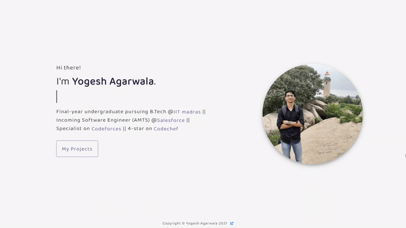
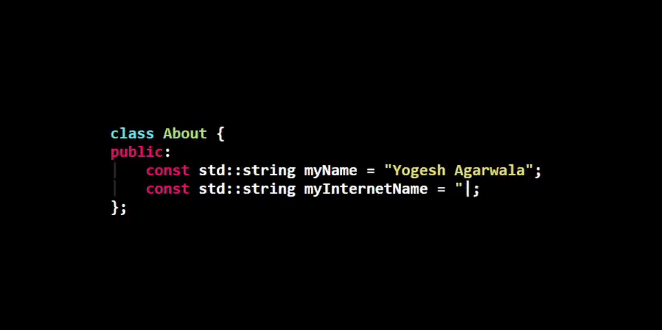

About
-----



<!--


```sh
class About {
public:
  const std::string myName = "Yogesh Agarwala";
  const std::string myInternetName = "yogeshiitm";
}
```
-->


<!--
### Hi there 👋

I'm <a href="https://yogeshiitm.github.io" target="_blank">Yogesh</a>, a second-year undergraduate at <a href="https://www.linkedin.com/posts/reachiitm_nirfrankings-nirfrankings2020-nirf2020-activity-6676763324744511488-qeDW" target="_blank">IIT Madras</a>. I am a passionate problem solver and an avid <a href="https://www.hackerrank.com/yogeshiitm" target="_blank">coder</a>. Thank you for visiting my profile!


- 🔭 I’m currently working with Team TechHD for developing a system to <a href="https://github.com/yogeshiitm/EY-Techathon" target="_blank">Prioritize Covid-19 Vaccine Delivery</a>.
- 🌱 I’m currently learning... well everything 😅
- ⚡ Connect with me on <a href="https://www.linkedin.com/in/yogeshiitm/" target="_blank">LinkedIn</a>!
- 👨🏻‍💻 Find my recent work here: <a href="https://yogeshiitm.github.io/projects" target="_blank">Projects</a> and <a href="https://yogeshiitm.github.io/competitions" target="_blank">Hackathons</a>!
- 💬 My website: [Click to view](https://yogeshiitm.github.io)
- ▶️ Youtube channel: [Click to view](https://www.youtube.com/channel/UCcEMOnvFeQaN9fR6F-ZP95Q)


- 🔭 I’m currently working with [Team Sahaay](http://cfi.iitm.ac.in/wordpress/index.php/sahaay/) for developing a prototype of an Electronic Travel Aid (ETA) for blind people.
- 🌱 I'm looking forward to learning new skills!
- 🌱 Looking forward to learning new skills!
- 👯 Let's connect on [LinkedIn](https://www.linkedin.com/in/yogeshiitm/)!
- 👯 I’m looking to collaborate on any fun or innovative project
- 👨🏻‍💻 You can  find my recent projects <a href="https://yogeshiitm.github.io/projects" target="_blank">here</a>!
- 💬 How to reach me: yogeshiitm1[at]gmail[dot]com
- 💬 Ask me about programming or anything related to tech!
- 💬 Ping me about open-source, android, flutter, material-design, development
- 📫 How to reach me: yogesh[at]smail.iitm.ac.in or yogeshiitm1[at]gmail[dot]com
- ⚡ Fun fact: I'm silent outside but talkative inside xD 
- ⚡ Fun fact: I forget to sleep while I am coding xD
- ⚡ Motto: Eat, Sleep, Code, Repeat!
-->

<!--
I'm Yogesh, a second-year undergraduate at IIT Madras. I am a passionate problem solver and an avid coder. Thank you for visiting my profile!
- 🌱 I’m currently learning design and implementation of web apps with Python, JavaScript, and SQL using frameworks like Django, React, and Bootstrap.
- 👯 Connect with me on [Linkedin](https://www.linkedin.com/in/yogeshiitm/)
- 💬 Ask me about programming, tech or life at IIT (xD)
- 💬 Ask me about programming, tech or just say hello!
- ⚡ Fun fact: I don't trust words. I trust vibes.
- ⚡ Fun fact: I am a [talkative introvert](https://www.16personalities.com/articles/the-mystery-of-the-talkative-introvert).
-->

<!--
### Hi there 👋

- 🔭 I’m currently working on ...
- 🌱 I’m currently learning ...
- 👯 I’m looking to collaborate on ...
- 🤔 I’m looking for help with ...
- 💬 Ask me about ...
- 📫 How to reach me: ...
- 😄 Pronouns: ...
- ⚡ Fun fact: ...
-->

